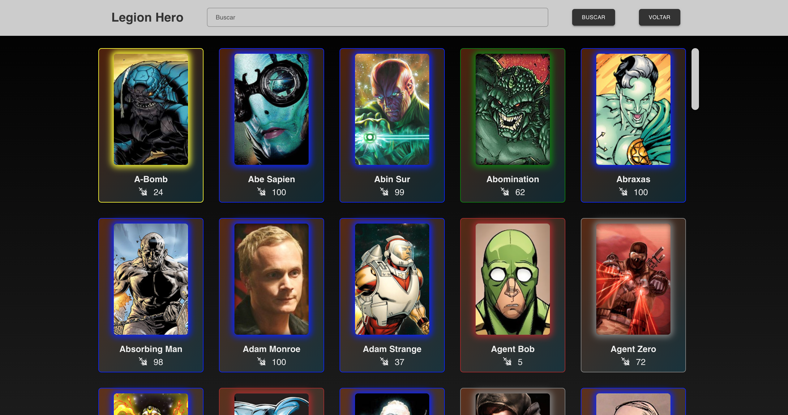
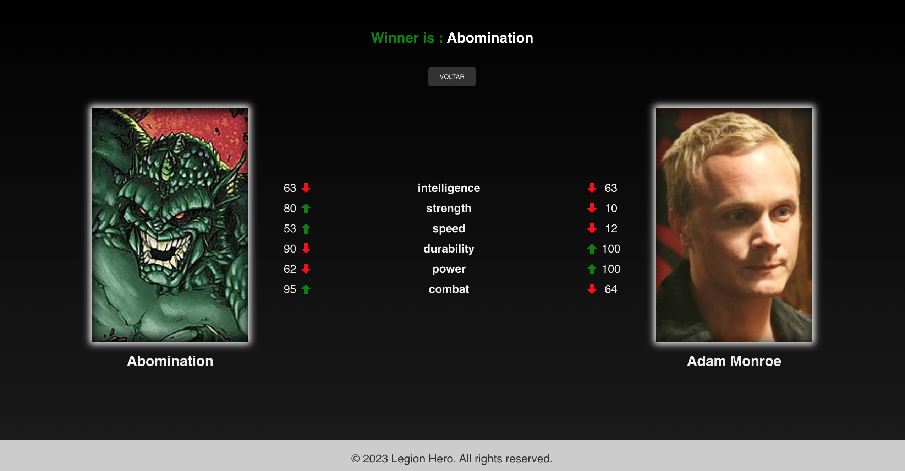

<h1 align="center"> Legion Hero </h1>

Desenvolvido por Ivan Barbosa. 

  
  

 

## 💻 Projeto

- Foi desenvolvido 2 paginas web: 
   - A página Home lida com a busca de metahumanos da API, a seleção de cartões, a atualização de resultados de pesquisa e a navegação para a página do herói quando 2 cartões são selecionados. Também permite ao usuário pesquisar metahumanos por nome e redefinir a pesquisa quando o campo de pesquisa está vazio. 
   - A página Hero lida com a visualização de dois heróis, calcula suas estatísticas, compara-as e exibe o vencedor. Ele também permite ao usuário voltar à página inicial.

## 🚀 Tecnologias

Esse projeto foi desenvolvido com as seguintes tecnologias:

- Node.js
- React / Vite
- JavaScript
- Material-UI
- CSS / Styled Components

## 🔖 Dependências

Para o Cliente, usamos:
- React 18.2.*
- styled-components 6.1.*
- Node.js v18.12.*
- axios 1.6.*

## 💻 Clone e acesse o projeto
------------
    `https://github.com/ivanbs14/LegionHero.git`

    or 

    `gh repo clone ivanbs14/LegionHero`

## 💻 Configurar e executar cliente
------------
Acesse a pasta do cliente:

`cd legion-hero/`

Agora, instale e execute seu aplicativo

`npm install`

`npm run dev`

Verifique se o aplicativo front-end esta em execução no local: http://localhost:5173/  (este endereço acima pode variar)

## Qualquer dúvida, envie um e-mail para

`ivanbarbosag@gmail.com`

---
